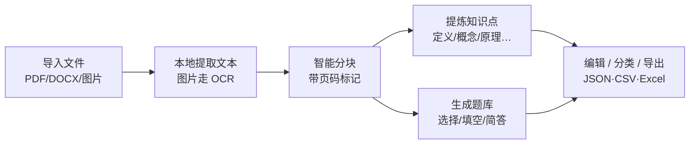

# 嵌入式校招八股 · 使用教程

> 适合对象：第一次使用的你。按 §1 的「5 分钟上手路径」走一遍即可开始用。
>
> 配套版本：v2.0.2 修复版（2026-09-30）
> 配套文档：[部署说明.md](部署说明.md)（环境配置）、[测试用例.md](测试用例.md)（质量验证）

---

## 目录

1. [5 分钟上手路径](#1-5-分钟上手路径)
2. [快速开始](#2-快速开始)
3. [界面全景](#3-界面全景)
4. [基础浏览功能](#4-基础浏览功能)
5. [AI 分级复习（核心）](#5-ai-分级复习核心)
6. [另一个篮子](#6-另一个篮子)
7. [复习模式 · 每日工作流](#7-复习模式--每日工作流)
8. [多设备同步](#8-多设备同步)
9. [文件导入与内容提取](#9-文件导入与内容提取导入提取工作台)
10. [常见问题](#10-常见问题)
11. [进阶：自定义规则](#11-进阶自定义规则)
12. [操作速查表](#12-操作速查表)

---

## 1. 5 分钟上手路径

完全不熟悉系统的话，按这个顺序体验一遍，5 分钟就能理解全部核心机制：

| 步 | 做什么 | 你会看到什么 |
|---|---|---|
| 1 | 启动服务并打开页面 | 296 道题，侧边栏「未记忆 296」 |
| 2 | 在搜索框输入「三次握手」 | 正文只剩握手相关题，标题关键词高亮 |
| 3 | 点任意卡片标题展开答案 | 看到「一句话结论」+ 展开详情 |
| 4 | 点卡片右上角的**等级按钮**（默认显示「未」） | 弹出 5 个等级，每个带判定标准 |
| 5 | 选「模糊」 | 侧边栏「模糊 1」，篮子按钮变「另一个篮子 (1)」 |
| 6 | 点顶部「另一个篮子 (1)」 | 右侧滑出抽屉，里面就是你刚标的题 |
| 7 | 点卡片右上角「**AI 自测**」，凭记忆写一段，点「提交判分」 | 约 3–10 秒后返回：要点覆盖率、说错了什么、遗漏什么、下一步建议 |
| 8 | 看判分结果底部的**毕业进度** | 「毕业进度 1/2 —— 今天再自测一次并达到熟练即可毕业」 |
| 9 | 点顶部「**复习模式**」 | 正文只留下今天该复习的题，其余全隐藏 |
| 10 | 点「退出复习模式」恢复 | — |

跑完这 10 步，你已经掌握了本系统 90% 的用法。

---

## 2. 快速开始

### 2.1 启动

**最简单：解压 zip 后，双击包内的 `启动.cmd`**

它会自动检查 Node、检查 Key、启动服务并打开浏览器。

**手动方式（在解压后的目录里执行）：**

```powershell
cd .            # 当前目录就是解压出来的「嵌入式八股复习系统_v2.0.2」
$env:DEEPSEEK_API_KEY="sk-你的key"
node server.js  # Windows 也可用包内的 runtime\node.exe
```

### 2.2 打开页面

| 地址 | 用途 |
|---|---|
| `http://localhost:8000/review` | 快捷入口，自动跳到总览页 |
| `http://localhost:8000/嵌入式校招八股_总览.html` | 完整文件名 |
| `http://localhost:8000/` | 目录列表，自由选择 |

> ⚠️ **不要双击 HTML 用 `file://` 打开。** AI 判分请求走相对路径 `/api/judge`，必须由 `server.js` 托管。双击打开时侧边栏会显示「判分服务未连接」。

### 2.3 确认服务正常

打开页面后看左侧「分级复习」盒子里这一行：

| 显示 | 含义 | 处理 |
|---|---|---|
| `AI 自测 0 次 · 平均覆盖 0%` | ✅ 判分服务已连接 | 可以正常用 AI 自测 |
| `判分服务未连接：请运行 node server.js` | ❌ 服务没跑或 Key 没配 | 见 [§10 常见问题](#10-常见问题) |

也可以命令行验证：

```powershell
curl.exe -s http://localhost:8000/api/health
# 期望 {"ok":true,"hasKey":true,"model":"deepseek-chat"}
```

---

## 3. 界面全景

```
┌──────────────────────────────────────────────────────────────┐
│ 侧边栏（aside）                                              │
│  ┌──────────────────────────────┐                            │
│  │ 分级复习                     │  ← 五级实时计数             │
│  │  未记忆 N  忘记了 N           │                            │
│  │  模糊  N  熟练  N  完全掌握 N │                            │
│  │  待复习 N 题 · 未毕业 M 题    │  ← 今日到期 / 总未毕业      │
│  │  ████████░░░░░░░░  (进度条)   │  ← 已毕业占比               │
│  │  AI 自测 N 次 · 平均覆盖 N%   │  ← 判分服务状态 + 统计       │
│  │  [ 另一个篮子 (M) ]           │  ← 专项复习队列入口         │
│  └──────────────────────────────┘                            │
│                                                              │
│  C++           ← 章标题，点击折叠/展开整章                    │
│    2.0 基础    ← 分节标题，点击折叠本小节                    │
│      1 xxx ★★★                                              │
│      2 xxx ★★                                               │
│  ... 共 6 章 296 题                                          │
├──────────────────────────────────────────────────────────────┤
│ 正文（main）                                                 │
│  [搜索框] [全部展开] [复习模式] │ [导出进度] [导入进度] [导入提取]     │
│  ─────────────────────────────────────────────────────────   │
│  复习模式提示条（仅复习模式显示）                              │
│                                                              │
│  ┌── 卡片 ────────────────────────────┐                      │
│  │ 1. xxx  [未] [AI自测][深测]        │ ← 等级按钮 + 两个判分入口│
│  │   一句话结论…                      │                      │
│  │   ▸ 点击展开 / 收起详情            │                      │
│  └────────────────────────────────────┘                      │
└──────────────────────────────────────────────────────────────┘
```

**颜色约定**（五级记忆等级）：

| 等级 | 按钮文字 | 颜色 | 一句话含义 |
|---|---|---|---|
| 未记忆 | 未 | 灰 `#64748b` | 还没开始自测 |
| 忘记了 | 忘 | 红 `#dc2626` | 覆盖率 < 30%，基本想不起 |
| 模糊 | 糊 | 黄 `#d97706` | 覆盖率 30–60%，零散记得 |
| 熟练 | 熟 | 绿 `#059669` | 覆盖率 60–85%，大体能讲 |
| 完全掌握 | 精 | 蓝 `#2563eb` | 覆盖率 ≥ 85%，完整复述 |

---

## 4. 基础浏览功能

### 4.1 搜索
在搜索框输入关键词（如 `三次握手`、`智能指针`、`malloc`、`信号量`），**输入即实时过滤**，无需回车：
- 匹配范围：**题目标题 + 一句话结论 + 全部展开详情正文**
- 标题命中处黄色高亮；右侧显示「命中 N / 296」
- 无命中的分节、章节自动隐藏
- 清空搜索框恢复全部

### 4.2 展开 / 折叠
- 点卡片标题 → 展开/收起该题详情
- 点顶部「全部展开」→ 一键展开全部；文字变「全部折叠」，再点全部收起
- 点侧边栏章标题 → 折叠/展开整章；点分节标题 → 折叠/展开该小节
- 箭头指示：展开朝下 `▾`，折叠朝右 `▸`

### 4.3 目录跳转
点侧边栏题目名 → 跳转到对应卡片并**自动展开**。

### 4.4 星级权重
标题右侧 `★` 越多代表面试出现频率/重要度越高，★ 越高复习时越应优先。

### 4.5 流程图说明
流程图由 mermaid.js 渲染，**需要联网**。离线时该区域显示为图表源码文本，不影响题目内容阅读。手机浏览同样需要联网才能看图。

---

## 5. AI 分级复习（核心）

### 5.1 五级是怎么判出来的

系统把「你能不能讲出来」量化成 **要点覆盖率（coverage）** 这个 0–100 的数，再由 DeepSeek 对照标准答案评分：

| 覆盖率 coverage | 等级 | 说明 |
|---|---|---|
| `< 30` | 忘记了 | 答案里有但你没说的一律算遗漏 |
| `30 – 59` | 模糊 | 零散记得，不成体系 |
| `60 – 84` | 熟练 | 大体能讲，细节有缺 |
| `≥ 85` | 完全掌握 | 完整复述要点 |

还有两个附加规则：
- **准确率封顶**：若 `表述正确率 < 40`（有明显事实错误、概念张冠李戴），等级**最高只能给模糊**——防止「说得乱但全错」被误判高分。
- **空复述**：复述为空、跑题、或只抄了题目本身 → 覆盖率记 0，直接判「忘记了」。

> 口语化、顺序颠倒、用词不同但意思对，都算覆盖，不会苛刻。


### 5.2 第 1 次自测：快速判分（AI 自测）

适合日常复习，省 token、速度快。

1. **先别看答案**，凭记忆复述这道题
2. 点卡片右上角「**AI 自测**」
3. 面板提示：`凭记忆复述这道题（别看答案，能写多少写多少）：`
4. 在文本框写下你能想起的所有要点
5. 点「**提交判分**」
6. 等约 3–10 秒出结果

**示范**：题目「new 的过程中，operator new 只分配内存吗？」
> 可以写：`operator new 只负责分配内存，不调用构造函数；new 表达式会先调 operator new 分配，再调 placement new 在该内存上构造，而 malloc 只分配内存不做任何构造。`

### 5.3 深度自测（深测）

防止「看答案觉得会了」的自欺。由 DeepSeek 先出 3 道简答题，你答完统一判分。

1. 点卡片右上角「**深测**」
2. 点「**让 DeepSeek 出题**」（按钮文字在出过题后变「重新出题」）
3. 等约 3–8 秒，出现 3 道题，分别侧重：
   - **核心概念**（Q1）
   - **易混对比**（Q2）
   - **实际场景或细节追问**（Q3）
4. 逐题用 1–3 句话回答
5. 点「**提交判分**」→ 综合评分（按各题要点数量**加权平均**，某题完全没答则该题要点全进「遗漏要点」）

> **什么时候用深测**：这个题已经毕业过一两次后做抽查；或你对某题特别有把握，想验证是不是真的会了。

### 5.4 判分结果怎么读

```
┌──────────────────────────────────────────────┐
│ [模糊]    42 要点覆盖率    60 表述正确率       │  ← 等级徽章 + 两个分数
│ ████████░░░░░░░░░░░░░░░░░░░░░░░░░░░░░░       │
│ 0 忘记了   30 模糊   60 熟练   85 完全掌握    │  ← 刻度尺，看自己落在哪
│                                              │
│ 说错了                                        │  ← 事实性错误，重点看
│   · xxx                                      │
│ 遗漏要点                                      │  ← 该说但没说的
│   · xxx                                      │
│ 点评：xxx                                    │
│ 下一步：xxx                                  │
│                                              │
│ 模糊档：1 天后再次复习。注意——模糊不计入达标… │  ← 本次判分的影响
└──────────────────────────────────────────────┘
```

| 字段 | 含义 | 要怎么用它 |
|---|---|---|
| 要点覆盖率 | 覆盖了标准答案中多少关键点 | 决定等级和排期 |
| 表述正确率 | 说的内容中正确比例 | < 40 时等级封顶模糊 |
| 说错了 | 事实错误、概念张冠李戴 | **优先级最高，立刻回去看答案** |
| 遗漏要点 | 答案里有你没说的 | 逐条对照补，这是提分空间 |
| 点评 | 针对性评价 | 了解自己的表述习惯问题 |
| 下一步 | 一句建议 | 按建议安排下次复习 |

### 5.5 手动标记等级（不依赖 AI，离线也能用）

不想打字、或没启动判分服务时，可以直接手动标：

1. 点卡片右上角**等级按钮**（当前显示「未/忘/糊/熟/精」之一）
2. 弹出 5 个选项，每项带判定标准说明
3. 点选一个 → 立即生效，统计、篮子、复习模式全部同步

也可以在「另一个篮子」里直接点条目底部的 `忘记了 / 模糊 / 记住了` 三个按钮。

> 手动标记同样计入**间隔排期与毕业门控**，但不增加「AI 自测次数」统计。

### 5.6 强制重学（判为「忘记了」时）

这是一道硬门槛，防止跳过低分直接划走：

1. 判为「忘记了」→ 面板出现橙色提示条 **`触发了强制重学`**
2. 输入框被锁，显示 `需先回顾答案：点击上方卡片标题展开答案，然后点下面的「已回顾答案，开始复述」。`
3. **展开卡片详情看答案**
4. 点「**已回顾答案，开始复述**」→ 输入框解锁
5. 再复述一次提交

同时该题被**重置为当天立即到期**（`interval=0`，`due=now`），会马上出现在复习模式里。

### 5.7 毕业门控：连续 2 次达标才算会

**这是本系统最核心的规则**：单次高分不算毕业，必须**连续 2 次**自测达到「熟练」及以上。

```
第 1 次判 skilled/mastered  →  毕业进度 1/2 →  当天必须再测一次（间隔 1 天）
第 2 次判 skilled/mastered  →  毕业进度 2/2 →  毕业！进入长期间隔
中途任何一次判 forgotten   →  gate 归零，重新计数
```

> 「模糊」**不计入达标**，但也不清零。所以哪怕中间夹一次模糊，只要没忘，仍保留之前的进度。

### 5.8 间隔排期表

判分后，系统按等级安排下次复习时间：

| 本次判定 | 下次复习 | 间隔天数 |
|---|---|---|
| 忘记了 | 当天立即 | 0 天 |
| 模糊 | 递进 | `1 → 3 → 7` 天（到 7 天封顶） |
| 熟练（毕业前） | 当天补测 | 1 天 |
| 熟练（毕业后） | 递增 | `7 → 15 → 30 → 60` 天后封顶 |
| 完全掌握（毕业后） | 递增 | `30 → 60 → 120` 天后封顶 |

**毕业后自动复查**：到长期间隔终点后，题会自动重新入队，`gate` 归零，需要再连续 2 次达标才能重新毕业——确保是真的记住了而不是考完就忘。

---

## 6. 另一个篮子

「另一个篮子」= **专项复习队列**，存放所有**还没毕业**的题。

### 6.1 什么情况会进篮子

| 状态 | 是否入篮 |
|---|---|
| 未记忆（没标过等级） | ❌ |
| 忘记了 | ✅ |
| 模糊 | ✅ |
| 熟练但还没凑够 2 次 | ✅ |
| 连续 2 次达标已毕业 | ❌ |

### 6.2 抽屉里能看到什么

点侧边栏「另一个篮子 (N)」打开抽屉：

```
┌────────────────────────────────────────┐
│ 另一个篮子 · 专项复习            [×]   │
│ 未连续 2 次达标（未毕业）的题都会进这里…│
├────────────────────────────────────────┤
│ [模糊]  TCP 为什么要三次握手？    明天  │  ← 点标题行展开
│  一句话：三次握手是为了…               │
│  毕业进度 0/2 · 已自测 3 次             │
│  [忘记了] [模糊] [记住了]              │  ← 手动反馈按钮
├────────────────────────────────────────┤
│ [忘]  new 的过程中…            待复习  │  ← 红色=已逾期
│  …需强制重学                          │
└────────────────────────────────────────┘
```

**到期时间文字含义**：

| 显示 | 意思 |
|---|---|
| `待复习`（红色加粗） | 已到期，该复习了 |
| `明天` | 1 天后到期 |
| `N 天后` | 还有 N 天 |
| `未排期` | 未安排（一般不该出现） |

篮子按到期时间**升序排列**，最紧急的一直在最上面。

### 6.3 用篮子做快速反馈

不想打开题卡答题时，可以在篮子里直接标：点「记住了」→ 计一次达标；点「模糊」→ 推后 1–3 天；点「忘记了」→ 触发当天强制重学。

适合通勤路上过一遍眼熟度。

---

## 7. 复习模式 · 每日工作流

### 7.1 复习模式是什么

点顶部「**复习模式**」，正文**只显示今天到期且未毕业**的题，其余全部隐藏——不会被 296 题的总量吓到，只专心处理手头该复习的。

顶部会显示提示条：

> 复习模式：仅显示今日待复习且未毕业的题目（共 N 道）。答完用「AI 自测」判分，连续 2 次达到熟练即毕业。

### 7.2 无题可复习时

显示空态提示：

> 今日没有待复习的题目
> 判分入口：卡片右上角「AI 自测」（默写复述判分）/「深测」（AI 出题）
> 未连续 2 次达到熟练的题会留在篮子里，到期自动出现在这里

**这时候该干什么**：去学新题！找还没标过等级的题，用「AI 自测」或「深测」起一轮。

### 7.3 推荐每日流程

```
第 1 步  打开页面 → 点「复习模式」
        看今天有几道待复习

第 2 步  对每道题：
           a. 先别看答案，凭记忆讲一遍
           b. 点「AI 自测」→ 写复述 → 提交判分
           c. 看「说错了」和「遗漏要点」
           d. 判为「忘记了」→ 看答案 → 点「已回顾答案，开始复述」→ 再测
           e. 判为「模糊」→ 看答案补遗漏，明天再来

第 3 步  待复习清零后，退出复习模式
        挑 3–5 道新题，同样方式起一轮

第 4 步  每周点一次「深测」抽查 2–3 道已毕业的题
        验证是不是真记住了

第 5 步  一周结束点「导出进度」存一份备份
```

### 7.4 每周看一眼进度

侧边栏「分级复习」盒子里：

| 指标 | 怎么看 |
|---|---|
| 进度条 | 已毕业（熟练+完全掌握）占比，越满越好 |
| `待复习 N 题` | 今日到期的量，控制在你愿意承受的范围 |
| `未毕业 M 题` | 总欠账量，如果一直涨说明新题起太多 |
| `平均覆盖 N%` | 复述质量的平均水平，低于 60 说明方法要调整 |
| `翻车 N 次` | 判为「忘记了」的累计次数，反映记忆薄弱点数量 |

---

## 8. 多设备同步

手机和电脑的进度**默认各自独立**，需要手动同步。

### 8.1 电脑 → 手机（最常见）

1. 电脑上点顶部「**导出进度**」→ 下载 `嵌入式八股-复习进度-YYYYMMDD-HHMM.json`
2. 把文件发到手机（微信文件传输助手 / QQ / 数据线 / 网盘均可）
3. 手机浏览器打开同一地址：
   ```
   http://<电脑IP>:8000/review
   ```
   电脑 IP 查询：`ipconfig` 看 WLAN 的 IPv4 地址
4. 手机端点「**导入进度**」→ **粘贴内容** → 粘贴 JSON 原文 →「解析」→「确认导入」

> 手机上不方便选文件时，用**粘贴**更方便：直接把这台电脑导出的 JSON 文本全选复制，粘到手机输入框里。

### 8.2 手机 → 电脑

反过来：手机点「导出进度」→ 把 JSON 内容复制（或存为文件发回电脑）→ 电脑点「导入进度」→ 「选择文件」或「粘贴内容」。

### 8.3 三种导入方式

| 方式 | 操作 |
|---|---|
| 选择文件 | 点 `点击选择，或把 JSON 文件拖到这里` 区域选文件；或直接把文件拖到该区域 |
| 粘贴内容 | 点「粘贴内容」Tab → 粘贴 JSON 原文 → 点「解析」 |

### 8.4 导入前会先给你看预览（不会直接覆盖）

点「解析」或选好文件后，弹窗会显示：

- **新增 / 合并更新 / 无变化** 三个数字
- 文件来源（哪台设备、什么时候导出的）
- 变更示例列表，如 `熟练 → 完全掌握`
- 若两设备对同一题有不同进度，会出现黄色说明

确认无误再点「**确认导入**」；点「取消」或 ESC 或点遮罩空白处都不写入。

### 8.5 合并规则（重要）

系统**不做简单覆盖**，而是以「复习历史的完整度」为准：

- 谁的复习记录更完整（自测次数 + 历史条数更多），就以谁为基准
- 另一方独有的复习记录，按时间顺序**补进**基准（去重、不虚增）
- **旧备份导入不会让你的新进度倒退**
- 你在当前设备上**手动标记的判断优先**（因为它的时间最新）

### 8.6 注意事项

- ⚠️ **依赖设备时钟正确**：合并靠时间戳判新旧，**手机请开自动同步时间**，否则时钟超前会让旧结果覆盖新进度。
- 进度存在**每个浏览器各自的 localStorage**。电脑 Chrome、手机 Safari、微信内置浏览器三者互不相通。
- 清除浏览器数据会清空进度，**建议每周导出备份一次**。

---

## 9. 文件导入与内容提取（导入提取工作台）

### 9.1 这个功能是干什么的

点顶部工具栏的**「导入提取」**，把 PDF / Word / 图片资料丢进来，系统会：



**全程本地解析，原文不上传**；只有「提炼知识点 / 生成题库」这两步需要服务端把文本块发给 DeepSeek 分析。

### 9.2 第 1 步 · 导入文件

点「导入提取」→ 拖文件到虚线区（或点它弹文件选择框）→ 点右下角「**开始提取**」。

| 规则 | 说明 |
|---|---|
| 支持格式 | `.pdf` / `.docx` / `.jpg` / `.jpeg` / `.png` / `.gif` |
| 大小上限 | 单个文件 ≤ **50MB** |
| 批量 | 支持多选 / 一次拖多个，最多 **2 个同时提取** |
| 格式校验 | 校验文件头魔数，**改后缀的伪装文件会被拒** |
| 旧版 .doc | 不支持，会提示「请先用 Word 另存为 .docx」 |

被拒的文件不会消失，会以红色「失败」状态留在队列表里并说明原因。

### 9.3 第 2 步 · 提取进度

切到「**2 · 提取进度**」页签可以看到：

- **队列 / 已完成 / 提取文本字符数 / OCR 页数 / 文本分块** 五个实时计数
- 每个文件的详细日志（开始时间、耗时、分块数）
- 不同类型文件的提取机制：

| 文件类型 | 提取方式 | 说明 |
|---|---|---|
| PDF | 浏览器内置 pdf.js 逐页取文字 | 每页文字 < 50 字符判定为**扫描页**，自动转图片 OCR |
| DOCX | mammoth 转 Markdown 文本 | 按空行分段 |
| 图片 | tesseract.js OCR（中文+英文） | 首次使用需下载约 20MB 中文识别包 |

**性能护栏**：OCR 上限 **30 页/文件**，超出页跳过并标记「部分完成（warn）」；渲染分辨率上限 150dpi。50MB 以内文件通常在 30 秒内完成（纯文本 PDF 更快；满 30 页 OCR 视机器性能可能到分钟级）。

### 9.4 第 3 步 · 提炼知识点 / 生成题库

切到「**3 · 知识点 / 题库**」页签，点「**提炼知识点**」或「**生成题库**」（这两个按钮走服务端 AI，**离线时不可用**）：

| 产出 | 类型（自动分类） |
|---|---|
| 知识点 | 定义 / 概念 / **原理** / 公式 / 易错点 |
| 题库 | 选择题（4 选项）/ 填空题 / 简答题 |

每条结果都带**来源文件 + 来源页码**（如 `[页3]`），可回溯原文核对；**低置信度**的结果会黄色高亮提醒人工复核。

### 9.5 结果编辑、分类与导出

- **编辑**：标题、正文、选项、答案都可以直接改，自动保存（防抖 400ms 落库）
- **状态**：每条可点「待确认 ↔ 已确认」，也可「全部确认」一键过
- **分类**：顶部的文件胶囊可按来源文件筛选；标签可批量编辑
- **导出三种格式**：

| 格式 | 用途 |
|---|---|
| **JSON** | 全量结构化备份（含文件清单），可再次导回其他工具 |
| **CSV** | 带 BOM，Excel 直接双击打开不乱码 |
| **Excel（.xlsx）** | 3 个 sheet：知识点 / 题库 / 文件清单 |

### 9.6 数据存在哪

提取结果保存在浏览器 IndexedDB（`eb-extract-v1`），**刷新、关页面都不丢**，下次打开自动恢复。「清空工作台」会连库一起清空，慎用。

### 9.7 提取功能 FAQ

**Q1：点「提炼知识点」没反应 / 提示失败？**
检查服务是否在跑（判分能用的环境它就能用）。提炼与判分共用同一个服务端代理。

**Q2：OCR 特别慢？**
首次使用要下载约 20MB 中文识别包（之后走缓存）；纯图片/扫描件越多越慢，这是正常现象，可以先去干别的。

**Q3：导入 PDF 后有些页是空的？**
那是纯图片且 OCR 超了 30 页上限的页，状态会标 warn；或该页没有文字层也不是清晰扫描件。

**Q4：提示「CDN 资源加载失败」？**
提取依赖 4 个公共 CDN 库（pdf.js / mammoth / tesseract / SheetJS），**需要联网**。离线时只能看已提取的内容，不能导入新文件。

---

## 10. 常见问题

### Q1：侧边栏显示「判分服务未连接」？

依次检查：

1. `node server.js` 是否还在运行（终端窗口关了就停了）
2. 是否用 `file://` 打开的页面？**必须**用 `http://localhost:8000/...` 访问
3. Key 是否配置：`curl.exe -s http://localhost:8000/api/health`，看 `hasKey` 是否为 `true`
4. 端口是否变了：`node server.js 9000` 启动的话，页面也要用 `:9000`

服务没启动时，**手动标记等级、篮子、复习模式、导入导出都能正常用**，只是不能用 AI 判分。

### Q2：判分报 `DeepSeek 返回 401`？

Key 无效或没额度。检查 `sk-` 开头是否正确、账户是否有余额。服务端不会把 Key 显示在页面上。

### Q3：判分很慢或超时？

单次判分 60 秒超时。「深测」要先生题再判分，等于两次请求，会更慢。网络差时优先用「快速判分」。

### Q4：判出来的等级我觉得不准？

评分标准是「标准答案要点覆盖率」。如果你说的内容对但用词不同，一般会被算覆盖；但如果一个要点对应多个关键词，可能漏判。这种情况：
- 短期：直接用手动标记修正等级
- 长期：可以改判分 Prompt（见 [§11](#11-进阶自定义规则)）

### Q5：为什么我刚标「模糊」却不进复习模式？

因为模糊的排期是 **1 天后**，你现在标完要到明天才"今日待复习"。这是间隔重复的正常设计，不是 bug。只有判为「忘记了」的才会当天立刻回到复习模式。

### Q6：为什么手机打开的进度是空的？

进度存在各浏览器 localStorage 里，手机是全新环境。需要按 [§8](#8-多设备同步) 导入。或者反过来，先在手机上复习，复习完导出回电脑。

### Q7：进度会不会丢？

- 刷新页面 / 关浏览器再开：**不丢**
- 换浏览器 / 换设备 / 清除站点数据 / 无痕模式：**会丢**
- 因此**定期导出备份**是必要的

### Q8：能一次看多道题的答案对比吗？

点顶部「全部展开」即可展开当前筛选结果的全部题，方便横向对比概念。

### Q9：流程图显示成一堆代码？

离线了。mermaid.js 需要联网加载；联网后刷新即可恢复。

### Q10：历史记录会被无限存下去吗？

不会。每道题只保留最近 **60 条**事件，超出自动裁剪，既够回溯又不会让存储无限膨胀。

---

## 10. 进阶：自定义规则

以下修改都需要编辑 HTML 源码，改前建议先备份。

### 10.1 调整判分阈值（30 / 60 / 85）

位置：`server.js` 的 `judgeSystem()` Prompt，以及 `normLevel()` 的兜底逻辑。

改完**重启服务**才生效。改完请同步更新《测试用例.md》§3.1 的边界取值表。

### 10.2 调整间隔排期

位置：HTML 内 `applyVerdict()` 函数附近：

```javascript
var SKILLED_TRACK  = [7, 15, 30, 60];    // 熟练毕业后：7→15→30→60 天
var MASTERED_TRACK = [30, 60, 120];      // 完全掌握毕业后：30→60→120 天
```

模糊档递增在 `applyVerdict` 内：

```javascript
c.interval = c.interval >= 7 ? 7 : Math.max(1, Math.round((c.interval || 0) * 3));
```

### 10.3 调整毕业门限（连续几次才算会）

搜索 `gate >= 2`，出现在 `applyVerdict()` 和 `inQueue()` 两处，**必须同时改**，否则入队判据和毕业判据会不一致。

### 10.4 彻底重置所有进度

```javascript
localStorage.clear(); location.reload();
```

---

## 11. 操作速查表

### 界面操作

| 目的 | 操作 |
|---|---|
| 搜索题目 | 搜索框输入，实时过滤 |
| 展开/收起一题 | 点卡片标题 |
| 展开/收起全部 | 顶部「全部展开」 |
| 折叠/展开整章 | 点侧边栏章标题 |
| 折叠/展开小节 | 点侧边栏分节标题 |
| 跳到某题 | 点侧边栏题目名 |
| 打开专项队列 | 侧边栏「另一个篮子 (N)」 |
| 只看今日待复习 | 顶部「复习模式」 |
| 备份进度 | 顶部「导出进度」 |
| 合并别处进度 | 顶部「导入进度」 |
| 导入资料提取知识点/题库 | 顶部「导入提取」 |
| 导出提取结果 | 工作台「3 · 知识点 / 题库」→ 导出 JSON / CSV / Excel |

### 复习操作

| 目的 | 操作 |
|---|---|
| 日常判分 | 卡片右上角「AI 自测」→ 复述 →「提交判分」 |
| 严格抽查 | 卡片右上角「深测」→「让 DeepSeek 出题」→ 作答 →「提交判分」 |
| 快速标等级 | 点卡片等级按钮 → 选一项 |
| 篮中快速反馈 | 篮子条目底部「忘记了 / 模糊 / 记住了」 |
| 触发强制重学后继续 | 展开答案 →「已回顾答案，开始复述」 |
| 标记为未学 | 等级按钮选「未记忆」 |

### 快捷键与细节

| 操作 | 效果 |
|---|---|
| `ESC` | 关闭篮子抽屉 / 导入弹窗 |
| 点导入弹窗遮罩空白处 | 关闭弹窗，不写入 |
| 等级弹窗中的判定说明 | 悬停/直接看选项下方的灰字 |
| `N` 天后到期 | 篮子里显示 `N 天后`，红色 = 已逾期 |

---

## 附：状态速查

| 我看到 | 说明 |
|---|---|
| 篮子 `(0)`，待复习 `0 题` | 干净状态，还没开始 |
| 某题显示黄色「糊」 | 模糊，1–3 天后再来 |
| 某题显示绿色「熟」但仍在篮子 | 差 1 次达标就能毕业 |
| 某题显示蓝色「精」且不在篮子 | 已毕业，按长期间隔安排复查 |
| 面板橙色提示「触发了强制重学」 | 上次判忘了，必须先看答案再复述 |
| 卡片右上角出现 `.quiz-restudy` 橙条 | 同上 |

---

*教程内容与界面文字以当前版本为准；若调整阈值/间隔/门限，请同步更新本文 §5.1、§5.8、§11 与《测试用例.md》。*
